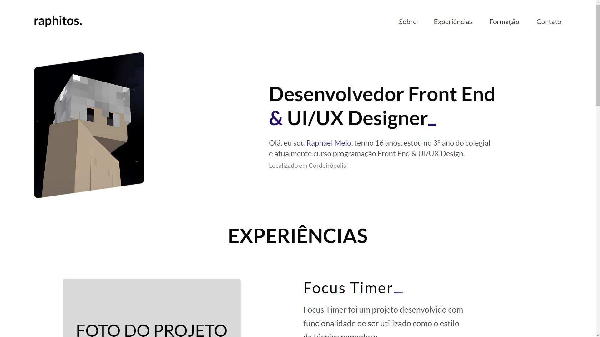

<h1 align="center"> Portfólio </h1>

  

  <a href="#-tecnologias" style="color: #517ac8;">Tecnologias</a>&nbsp;&nbsp;&nbsp;|&nbsp;&nbsp;&nbsp;
  <a href="#-projeto" style="color: #517ac8;">Projeto</a>&nbsp;&nbsp;&nbsp;|&nbsp;&nbsp;&nbsp;
  <a href="#-layout" style="color: #517ac8;">Layout</a>&nbsp;&nbsp;&nbsp;|&nbsp;&nbsp;&nbsp;
  <a href="#memo-licença" style="color: #517ac8;">Licença</a>

 

  

## 🚀 Tecnologias

Esse projeto foi desenvolvido com as seguintes tecnologias:

- HTML e CSS
- Github
- Figma

## 💻 Projeto

Projeto realizado para desenvolver e aperfeiçoar técnicas de UI Design.

- <a href="https://raphetes.github.io/portfolio/" style="color: #517ac8" target="_blank">Acesse o projeto</a>

## 🔖 Layout

Você pode visualizar o layout do projeto através <a href="https://www.figma.com/file/79oG53osjxN1UVLeOFIF9W/Meu-Projeto?type=design&node-id=6%3A290&mode=design&t=6hGfNUT6PQGUwQEE-1" style="color: #517ac8;" target="_blank">desse link</a>. É necessário ter conta no <a href="https://figma.com" style="color: #517ac8;" target="_blank">Figma</a> para acessá-lo.

---
## 📕 Licença

Feito por Raphael Melo.